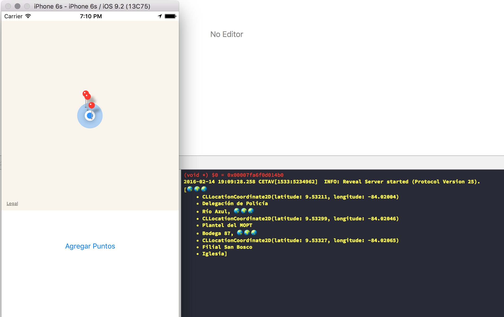

# CETAV_Mapa
Aplicación de ejemplo Swift para clases del `CETAV` semana 2

## Descripción

Aplicación aplicando los conceptos básicos de patrones de diseño y programación en `Swift` vistos durante las 2 primeras clases en el `CETAV`.

Cada paso está documentado y demarcado por `tag`s los cuales pueden ser accesados de la siguiente manera
```terminal
git reset --hard <nombre del tag>
```

Los `tag`s contenidos en el proyecto son los siguientes:

| **Nombre del `tag`** | **Descripción** |
|:-----------------|:------------|
| Inicio | Primer commit |
| 2 | Definir el modelo |
| 3 | Definimos carga de datos y retornamos datos |
| 4 | Agregamos el mapa a la vista |
| 5 | Agregamos el framework de `MapKit` |
| 6 | Centrar el mapa en la ubicación del usuario |
| 7 | Agregamos un `GPX` file para simular la ubicación |
| 8 | Centramos el mapa en el usuario |
| 9 | Centramos el mapa a 2Kms del usuario actual |
| 10 | Respondemos a evento del botón y al debug description personalizado |
| 11 | Corregidos los puntos del `GPX` file. Agregamos anotaciones al mapa |
| 12 | Botón inicia desactivado hasta que la región sea asignada |
| 13 | Convertir los puntos con `map` |

---

*Nota: Es importante antes de poder realizar el «salto» de `tag` tener el historial del repositorio limpio; es decir, ningún cambio pendiente en el repositorio ya que si no `git` no nos permitirá hacer el `rest --hard` al tag especificado.*

*En caso de no tener el historial limpio habrá que deshacer los cambios realizados a los archivos modificados mediante el siguiente comando:*

```terminal
git checkout -- <path del archivo con cambios>*
```

---


